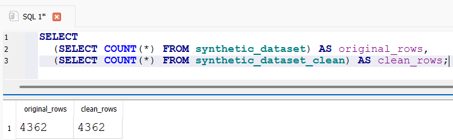
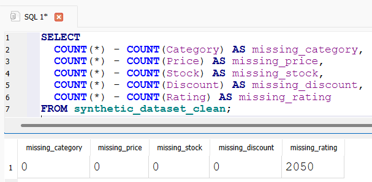

# Retail Product Dataset With Missing Values - SQL Showcase


---

## Business Problem

A retail company wants to better understand its product catalog, including pricing trends, customer ratings, inventory availability, and discount strategies, to identify opportunities for improving sales performance and product positioning. This SQL analysis explores key business questions such as category pricing differences, rating trends, discount patterns, and inventory relationships.

## Dataset Information

The dataset used in this project can be found in data/, and was originally sourced from [Kaggle](https://www.kaggle.com/datasets/himelsarder/retail-product-dataset-with-missing-values). It contains missing values across several fields, including Category (~63% missing), Price (~4%), Rating (~47%), Stock (~31%), and Discount (~9%). This analysis treats data quality as part of the process by identifying, measuring, and appropriately handling incomplete records to ensure accurate insights and reflect real-world analyst workflows.

## Data Cleaning

Before analysis, the raw dataset was checked for missing values across all five columns. Out of 4,363 total rows: Category was missing ~63% of values, Price was missing ~4%, Rating was missing ~47%, Stock was missing ~31%, and Discount was missing ~9%.

To preserve the original data for reference, a new table (synthetic_dataset_clean) was created rather than modifying the raw table directly. Missing values were then handled on a per-column basis, depending on the type of data and how much was missing:

- Category: missing values replaced with "Unknown", since dropping ~63% of rows wasn't a viable option
- Stock: missing values replaced with "Unknown", for the same reason (~31% missing)
- Price: missing values replaced with the average price across all non-null rows, since only ~4% of values were missing and a small amount of imputation has minimal impact on overall analysis
- Discount: missing values replaced with 0, under the assumption that no discount was recorded/applied
- Rating: left untouched (nulls remain nulls). Since Rating reflects customer sentiment and nearly half the values were missing, imputing a fabricated rating (e.g., average) could meaningfully distort sentiment based insights. Queries involving Rating will explicitly filter out nulls where relevant.

After creating the cleaned table, two verification checks were run to confirm the cleaning worked as intended:

- Row count check: confirmed synthetic_dataset_clean has the same number of rows as the original table, meaning no data was accidentally dropped.



- Remaining nulls check: confirmed that Category, Price, Stock, and Discount had zero missing values post-cleaning, and that Rating was the only column still showing missing values (2,050, matching the original count) as expected, since it was intentionally left untouched.



Full SQL for this process is available in sql/data.sql.

## Business Questions & Analysis

This section outlines the key business questions explored using SQL, along with the queries used to answer them and the insights gathered from the cleaned dataset.


### 1. Which product categories generate the highest average price?

```sql
SELECT Category, AVG(Price) AS avg_price
FROM synthetic_dataset_clean
GROUP BY Category
ORDER BY avg_price DESC;
```

**Findings:** Category B generates the highest avg price at ~$5,401

### 2. Which categories have the highest avg consumer rating?

```sql
SELECT Category, AVG(Rating) AS avg_rating
FROM synthetic_dataset_clean
WHERE Rating IS NOT NULL
GROUP BY Category
ORDER BY avg_rating DESC;
```

**Findings:** Category D has the highest avg consumer rating at 3.12

### 3. Compare original vs clean data side by side

```sql
SELECT 
  raw.Category AS original_category,
  clean.Category AS cleaned_category
FROM synthetic_dataset raw
INNER JOIN synthetic_dataset_clean clean
ON raw.rowid = clean.rowid;
```

**Findings:** No null values in the cleaned_category column


## Contact Information

You can contact me via email at [ethan-jacob@comcast.net](mailto:ethan-jacob@comcast.net) or connect with me on [LinkedIn](https://www.linkedin.com/in/ethan-dobbs).

Thank you for reviewing my 'Retail Product Dataset With Missing Values - SQL Showcase' project! I hope this provides a clearer representation of my current SQL proficiency.

## License

This project is licensed under the [MIT License](LICENSE).
 
